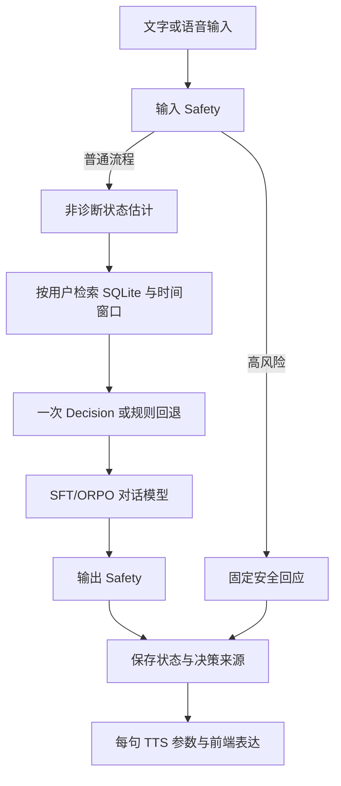

# 评估与演示

2026-09-23 补充：最新 R0～R4 认知/协同实验使用 `evaluate_coordination.py` 和 `export_coordination_trace.py`，见 [E1 实验设计与结果](mental_health_coordination_results.md)。既有 16 例与双模型顺序报告作为旧基线保留；下文“独立 Decision 尚未部署”等是当时记录，当前服务已接入，默认仍关闭，收益待 E 阶段验证。

更新：2026-09-22。固定虚构样例位于 `tests/fixtures/mental_health_cases.json`，包含普通支持、否定、引用、模糊表达、明确风险、多轮、历史变化、诊断请求、注入和故障。预期标签仅作开发参考，尚非专业人员标注的临床验证集。

## 可复现命令

```powershell
$env:PYTHONIOENCODING = 'utf-8'
.\.venv\Scripts\python.exe scripts/evaluate_mental_health.py --output logs/evaluation/engineering.json
.\.venv\Scripts\python.exe scripts/evaluate_mental_health.py --no-memory --output logs/evaluation/no-memory.json
.\.venv\Scripts\python.exe scripts/evaluate_mental_health.py --no-expression --output logs/evaluation/no-expression.json
.\.venv\Scripts\python.exe scripts/run_dialogue_api.py --adapter orpo
# 另一终端：
.\.venv\Scripts\python.exe scripts/evaluate_mental_health.py --dialogue model --model mental-health-orpo --output logs/evaluation/orpo.json
```

SFT 使用同一流程，把启动参数改成 `--adapter sft`，评估模型名改成 `mental-health-sft`。8 GB 显存机器应先停止已启动的模型服务，再顺序启动另一个。最后恢复 ORPO。API 密钥只读取本机配置，不写入报告。

独立 Decision 服务配置完成后可增加 `--decision model`。当前未部署，因此规则与真实 Decision 的质量对比保留待测；合成故障回退单独统计，不算模型调用成功率。每个变体都保留输入和输出 Safety。默认 stub 回答用于工程验证，不能作为对话模型效果。

每份报告记录 UTC 时间、上游提交、相关源码 SHA256、样例 SHA256、模型 ID、温度、输出长度上限、变体开关及逐样例结果。源码可能尚未 Git 提交，以文件哈希识别本次实现。延迟是本机观察值，包含状态存储和安全处理，不是受控性能基准；脚本没有 TTS/浏览器播放步骤，播放指标为 null。支持性、连贯性和不当诊断的人工评分保留空值。

## 已有结果

- 顺序复跑各 16 例无调用错误，源码、角色提示词与生成参数一致；两套各 12 次实际对话调用，均无长度截断。SFT/ORPO 平均流程 7.001/13.569 秒，见 [顺序逐例对照](mental_health_sequential_comparison.md)。每套仅运行一遍，未隔离整机负载，期间仍有开发和前端构建；不作为严格性能排名或模型质量结论。报告保留适配器和启动模板指纹。
- SFT 与 ORPO 各完成 16 个样例，均无调用错误；已生成 [逐例对照](mental_health_comparison.md)。平均流程时间分别为 2.955/5.197 秒，但 ORPO 运行时存在网页并发、源码哈希亦有差异，因此不作为严格性能或质量排名。
- 工程基线 16 个样例无运行错误；状态估计重复计算一致。
- Safety 暂定标签：TP=3、FP=2、TN=10、FN=0；1 个模糊案例不计混淆矩阵。两项误报来自否定和小说引用。小样本零漏报不代表总体安全有效。
- 相同输入在近期压力历史下选 reflect_and_clarify，关闭记忆或只有未知历史时选 supportive_listening。关闭表达后 Actions 为空；这只是参数输出消融，不能推断用户体验效果。
- Edge TTS 同一句虚构文本：0.8 速度 6648ms，1.2 速度 4440ms。style/energy 尚未实现，voice_applied 明确记录回退。
- 前端 5 项 Node 测试验证动作边界、未知参数、自然结束、打断和旧音频清理；新构建可显示数字人并完成文字回应。真人麦克风、实际动作观感和主观音质验收后置。
- 完整前端类型检查有 586 条上游诊断；与原源码对照，本轮新增 0 条。Web 构建通过，不把类型检查写成全通过。

## 演示顺序

自动顺序复跑（先停已有模型服务，输出目录必须是新目录）：

```powershell
.\.venv\Scripts\python.exe scripts/evaluate_dialogue_pair.py --output-dir logs/evaluation/NEW_RUN
.\.venv\Scripts\python.exe scripts/compare_mental_health.py logs/evaluation/NEW_RUN/sft.json logs/evaluation/NEW_RUN/orpo.json --output docs/mental_health_sequential_comparison.md
# 评估结束会关闭脚本拥有的模型服务，交互前恢复：
.\.venv\Scripts\python.exe scripts/run_dialogue_api.py --adapter orpo
```

脚本逐个启动、预热、评估并关闭自己创建的进程树。Windows 执行环境需允许该进程清理；首次运行因此中断，已完成的报告保留在 sequential-20260922。完成的复跑位于 sequential-20260922-r2。对照工具拒绝样例哈希不符、缺失/重复样例或关闭 Safety 的报告；角色提示词、生成参数、源码差异和截断次数会单独列出。

1. 启动 ORPO API 与 `run_server.py`，打开 `http://localhost:12393`。
2. 输入虚构的工作压力描述，观察回答、表情、短时点头与较慢语速。
3. 使用固定风险测试样例，核对模型被绕过并返回安全回应。
4. 新建聊天历史，确认长期状态按当前本机用户保留；使用管理命令查看记录。
5. 展示有无记忆/表达的报告，展示已知误报与待测项。


