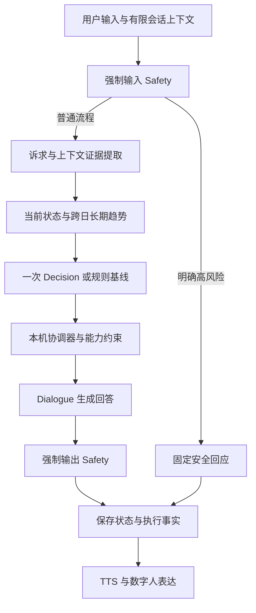

# 心迹认知与协同决策升级实施计划

> **For Claude:** REQUIRED SUB-SKILL: Use superpowers:executing-plans to implement this plan task-by-task.
> 本仓库执行时使用当前可用的 executing-plans 技能。后续开发以本文为主计划，逐批更新状态、验证记录和限制；不要求另开任务或启用子代理。

**Goal:** 在现有可运行原型上，建立依据用户诉求、上下文证据与跨日趋势的决策流程，并通过可追溯对照验证决策与对话分工的实际收益。

**Architecture:** 保留 MentalHealthAgent 编排与强制输入/输出 Safety。新增用户诉求上下文和确定性的决策协调规则；独立 Decision 每轮最多一次请求，同时返回 strategy、behavior、voice，Dialogue 负责最终回答。状态与安全先采用可解释规则升级，复杂多智能体协商保留为后续实验。

**Tech Stack:** Python、Pydantic、SQLite、OpenAI-compatible API、现有 SFT/ORPO 对话适配器、unittest、现有 React/Live2D/TTS 执行链。

版本：V1.15｜建立日期：2026-09-22｜更新：2026-09-24｜状态：原定 A～E 工程任务已完成；E3a～E3c 为补充实验，未使独立 Decision 成为默认；用户已停止继续扩展，E3d 不执行。人工评分/真人验收按约定后置。

## 一、上一阶段完成边界

可以进入本阶段，但上一阶段不能整体标记为全部验收完成：

| 项目 | 已有基础 | 承接方式 |
|---|---|---|
| 表达执行 | 表情、轻点头、注视、每句语速、打断/结束清理 | 保留；真人观感验收继续后置 |
| 长期状态 | 本机用户 SQLite、跨历史读取、纠正/删除/迁移、趋势 CLI | 升级统计方法和证据表示 |
| 评估 | 固定 16 例、双模型顺序对照、工程消融、来源哈希 | 保留为旧基线，扩展上下文与协作评价 |
| Decision | 固定 JSON 协议、一次请求、超时/格式回退 | 独立服务未部署，纳入 B 阶段 |
| 效果验证 | 工程测试与本地接口记录 | 人工质量评分、专业评审及真人验收仍待完成 |

已有完整回归记录为 66 项后端测试通过；随后 3 项趋势 CLI 专项测试通过；5 项前端专项测试通过。没有把新增测试数写成已执行过的 69 项完整回归。

本计划不重新训练 SFT/ORPO，不更换 ASR/VAD/WS/TTS/Live2D 基础设施。现有上游提交和 V1.6 源码检查点继续作为回退依据。

## 二、执行看板

| 阶段 | 目标 | 当前状态 | 进入下一阶段的依据 |
|---|---|---|---|
| A 用户诉求与决策协议 | 区分倾诉、求助、拒绝建议、结束等诉求，记录策略协调结果 | A1/A2 工程完成；文本遵循仍有已知偏差 | 85 项完整回归通过；规则与 ORPO 回放路由符合预期，非质量全部通过 |
| B 独立 Decision 接入 | 独立服务真实返回合法、适配诉求的决策 | B1/接入完成；C1 已知策略失败回测通过，默认仍保留规则 | 真实 Agent 10/10 策略匹配；协议控制例为本机文本覆盖，语义泛化/收益待 C2/E |
| C 上下文安全与状态估计 | 识别陈述主体、时态、否定、引用及不确定性 | C1/C2 工程完成，有限规则 v2 本机启用；剩余误报待改进 | 109 项回归；80 例确定标签 FP 18→7/FN 3→0，保留集关键风险无新增漏报 |
| D 长期统计改进 | 按天聚合、观测覆盖与新鲜度、反馈来源区分 | 工程完成，本机 daily_v2 | 完整 120 项测试；6 组虚构新旧统计对照通过 |
| E 协同效果对照 | 比较规则、模型、诉求和长期趋势的独立贡献 | E1/E2/E3a工程完成；E3b/E3c开发＋保留验证完成 | 157项回归；E3c两版同集均24/30，新增命中与反问退化抵消，保持实验状态与规则默认 |

主顺序：**A → B → C → D → E**。若 B 的模型资源暂不具备，先完成其适配与模拟故障验证，再继续 C/D；B 保持未完成，E 的真实模型分组保留待测。

2026-09-22 调整：B 已具备可并存的真实服务，但协议操控输入导致错误结束策略。保留 B 的未通过状态和规则默认，先进入 C 修复共同的上下文约束，再回测 B；不重复调参直到小样例“全绿”，不把协议合法率代替语义质量。

2026-09-22 C1 回测补充：该控制输入通过输入副本过滤、本机协调和明确标注的固定文本覆盖得到处理；真实 Agent 的 10 个策略场景均匹配。已知失败关闭，语义泛化与协同收益仍未验证，默认保持规则直至 C2/E 的证据充分。B 段保留原始失败记录供比较。

## 三、架构决策记录

### ADR-01：第一版保留一次 Decision 调用

- 决定：增加明确的诉求输入、协调器和执行记录；保持策略、行为、语音三组联合输出。
- 比较：纯规则方便回退但语义覆盖有限；独立 Decision 加 Dialogue 能比较职责分离收益；三个模型分别规划策略/行为/语音会增加时延、资源占用与冲突处理。
- 选择：本阶段以规则基线和独立 Decision 为两种实现，暂不增加额外审核模型调用。
- 表述边界：Safety、状态和存储是功能模块；三个 JSON 字段不是三个智能体。独立模型上线后描述为“决策与对话双角色协作”；没有独立提案与冲突协商实验时，不宣称完整多智能体协商已实现。

### ADR-02：协调规则在本机执行

- 优先级：Safety 强制约束 → 当前明确用户意愿 → 当前有效状态 → 新鲜且足量的长期信号 → 默认支持策略。
- 历史高压力不能覆盖用户“今天先不谈这个”的意愿；明确风险时 Safety 仍优先。
- 只保存结构化 reason_codes、来源和覆盖原因；不要求模型输出隐藏推理过程，不允许模型填写本机执行 trace。
- 模型无效或超时最多回退一次本地规则，不通过多次重试绕过每轮调用上限。

### ADR-03：长期趋势按日聚合

- 决定：先计算每天各维度均值，再对有效观测日等权聚合；原始记录保留，统计可重算。
- 代价：单日强烈波动会被均值平滑；展示最近状态和日内范围供解释，当前安全判断仍独立处理。
- 采用显式时区和连续日历窗口；旧滚动 7×24 小时算法冻结为 v1 对照，不静默替换历史报告。



## 四、A：用户诉求与决策协议

### A1 诉求 schema 与基础识别

**修改：** `src/open_llm_vtuber/mental_health/schemas.py`、`src/open_llm_vtuber/agent/agents/mental_health_agent.py`。

**新增：** `src/open_llm_vtuber/mental_health/intent_estimator.py`、`tests/test_user_intent.py`。

拟定输入协议（字段在实施时以 schema 和测试固定）：

```json
{
  "interaction_intent": {
    "primary": "venting",
    "advice_preference": "declined",
    "certainty": "explicit",
    "evidence_codes": ["explicit_listen_request", "explicit_no_advice"],
    "source": "current_turn"
  }
}
```

1. 增加 `primary` 固定值：small_talk、venting、seeking_clarification、seeking_practical_help、seeking_information、ending、unknown；使用主诉求＋建议偏好表示混合意图。
2. `advice_preference` 固定 requested/declined/unspecified，`certainty` 固定 explicit/inferred/unknown；不把启发式强弱写成校准概率。
3. 先编写对照回归：“只想倾诉”与“请给一个办法”、“先别建议”与“现在可以给建议了”、含糊输入、结束对话、指令注入。
4. 实现有限规则识别；unknown 不强行推断。当前明确表达覆盖上一轮；跨轮偏好限当前聊天，历史切换后清除。
5. 将诉求加入 DecisionContext 和 Dialogue 提示上下文；不增加 LLM 调用，不持久化原文证据片段。

**验收：** 固定明确样例能区分诉求；模糊样例返回 unknown；不同连接/历史不串联偏好；输入风险不会被“只想倾诉”跳过。

### A2 决策协调、版本兼容与记录

**修改：** `mental_health/schemas.py`、`decision_client.py`、`agent/agents/mental_health_agent.py`（均在 `src/open_llm_vtuber/`）。

**新增：** `src/open_llm_vtuber/mental_health/decision_coordinator.py`、`tests/test_decision_coordination.py`。

1. 先用测试固定“拒绝建议但模型选择解决问题”“历史压力但用户要求结束”等冲突的期望结果。
2. 协调器输入 DecisionResult、诉求、安全与能力上下文；输出最终 DecisionResult 和本机 CoordinationTrace，记录 proposed_strategy/final_strategy/reason_codes。
3. 为策略增加适当的结束支持及边界值（拟定 close_supportively），同步固定枚举、模型提示词、模板和协议测试；第一版不引入自由文本策略。
4. 记录前一轮最终策略与用户明确反馈；用户继续需要倾听时允许重复倾听，避免机械轮换策略。未回复、离线或打断均不视为负反馈。
5. 将协议版本写入本机配置、报告和 trace；旧状态读取保留默认，旧协议适配显式配置，禁止静默猜测。
6. 对 trace 和反馈采用结构化字段及长度限制，纳入现有纠正/删除范围；不保存模型推理正文。

**验收：** 冲突有确定结果与来源；原始提议和最终执行可追溯；输出 Safety 改写后最终记录与保守动作一致；Decision 正常最多一次请求，高风险零请求。

### A 阶段交付记录（2026-09-22）

- 已新增 IntentEstimator、InteractionIntent、DecisionCoordinator/CoordinationTrace，接入真实 Agent；模型正常每轮仍最多一次 Decision 请求。
- 已新增 close_supportively/acknowledge_closure、决策契约版本 2 与显式 v1 兼容；本机协调协议固定 v2，旧状态缺字段时读为 null。
- 建议偏好只在当前会话延续；当前明确表达覆盖历史偏好，历史切换/新 Agent 清空。剪贴板不设置意愿，取消生成不产生用户反馈，旧历史迟到结果不污染新会话。
- 原始提议、最终策略、上一策略、覆盖原因与实际 Safety 覆盖已记录；反馈纠正不重写真实执行 trace，删除范围与状态一致。
- 完整后端回归 85 项通过，Ruff 通过。7 例规则检查零模型请求；新增 10 场景/13 轮工程及 ORPO 回放，策略标签全部匹配，12 次真实对话调用无错误、无截断，高风险轮零调用。
- 服务已重启加载 A 阶段功能，启动检查 0 失败。细节见 [诉求与协调说明](../mental_health_intent.md) 和 [A 阶段回放记录](../mental_health_phase_a_results.md)。
- **未解决：** 协议操控样例中协调器保持倾听，但 ORPO 仍生成结束对话的文本。补强提示后的第二轮仍复现，原报告与失败回答保留；C/E 应检查文本对策略的遵循，不以路由成功冒充模型质量通过。意图仍为有限规则，复杂语义泛化未验证。

## 五、B：独立 Decision 接入

### B1 服务选择与资源探测

**修改：** `src/open_llm_vtuber/config_manager/agent.py`、`scripts/check_decision.py`、`docs/mental_health_decision.md`。

**新增：** `scripts/check_decision_resources.py`；确立实际服务后再新增与其对应的启动模板，避免创建虚构可用 endpoint。

1. 读取可用 GPU 显存、系统内存、现有模型文件与端口占用；先确认 ORPO 正常工作时的余量。
2. 比较本机小模型 CPU/量化运行、可并存的 GPU 服务、用户已具备的独立服务。选型时核查当时官方模型和推理框架资料，记录许可证与版本；本计划不预定未经验证的模型名或内存开销。
3. 保留现有对话模型，先独立运行固定 JSON 样例，再测与 Dialogue 同时在线。只做顺序换模型测试不能算双服务部署成功。
4. 如需新模型下载，先记录大小、存放位置和硬件条件；涉及付费或向远程服务发送真实对话需另有明确授权。

**验收：** 有真实模型 ID、权重/版本、运行方式和资源记录；没有把 SFT/ORPO 适配器当成已有独立决策服务。

### B2 实际接入与回退

**修改：** `mental_health/decision_client.py`、`agent/agent_factory.py`、`config_manager/agent.py`、`service_context.py`（位于 `src/open_llm_vtuber/`），以及 `scripts/check_decision.py`、`tests/test_decision_protocol.py`。

1. 将 A 阶段协议传给独立服务，严格校验三组输出、未知键、枚举、数值范围、截断和重复 JSON 键。
2. 使用真实 SDK 模拟超时、服务不可用、不合法结果；区分未请求、模型成功、回退、取消，不把回退计为模型成功。
3. 使用虚构数据验证高风险绕过、一次请求上限、并发隔离、打断后下一轮恢复、资源释放。
4. 至少保存三轮固定协议集的真实服务结果；统计合法率、回退率、p50/p95、总调用数与资源峰值。事先固定工程目标：普通样例合法率至少 95%，明确高风险零模型请求，故障样例均按预期回退；这些不是质量或临床指标。
5. 默认总超时沿用当前配置 15 秒；CPU 运行若无法满足，记录失败并重新选择运行方式，不通过放宽超时隐藏体验问题。

**验收：** 模型在线且输出经过协调器，能够证明实际改变策略；不达目标时保留规则默认，并记录未完成项。

### B 阶段交付记录（2026-09-22）

- 官方 Qwen2.5-1.5B Q4_K_M 与 llama.cpp b10964 CPU 部署完成，权重/运行时完整 SHA256 校验通过；独立 8001 服务与 ORPO 8000 同时在线，不换出 ORPO。
- 新增资源探测、已验证运行时启动脚本、配置模板、三轮统计和真实 SDK 生命周期检查；新增显式 `llama_json_schema`，总超时 15 秒、零重试、本机严格协议校验保持。
- 普通 JSON 12/18 合法，失败报告保留；schema 18/18 合法、零回退、高风险三次零请求，p50 5.17 秒、p95 5.80 秒。全机采样 GPU 峰值 5524 MiB、RAM 峰值约 18.24 GiB（ORPO 驻留，非完整链路峰值）。
- 实际 Agent + ORPO：10 场景/13 轮，11 次真实 Decision、12 次 Dialogue，无接口错误/截断；另有 1 次合成故障正确回退，高风险零模型调用。**1 个策略场景失败**：内部协议操控文本使模型提议并最终执行 close_supportively。此结果不满足默认启用条件。
- 两个并发真实请求均成功、一次取消向上传播、取消后真实请求恢复，共 4 次 HTTP 尝试，无重试；不据此声称多用户容量或精确显存释放已验证。
- 完整后端 91 项回归与 Ruff 通过。网页服务已重启，启动检查 0 失败、本机 HTTP 200、外部 Origin 403。主配置仍为规则 Decision + ORPO Dialogue；独立 Decision 只用于显式评估配置。
- 详细证据、模型版本、失败回答与使用命令见 [B 阶段报告](../mental_health_phase_b_results.md) 和 [Decision 说明](../mental_health_decision.md)。真人验收/人工评分继续后置。

## 六、C：上下文安全与状态估计

本阶段分两批交付：**C1 冻结旧规则与 80 例测试集、修复已复现的协议操控、真实双模型回测；C2 基于开发集实现主体/时态/否定/引用信号、状态观测与输出安全规则，再执行保留集风险回归**。C1 不改变旧 Safety 风险判断；C2 验证完成前不宣称否定/小说误报已修复。保留集按语义家族与开发集分离，C1 仅跑旧规则记录基线。

**修改：** `src/open_llm_vtuber/mental_health/safety_guard.py`、`state_estimator.py`、`schemas.py`、`src/open_llm_vtuber/agent/agents/mental_health_agent.py`。

**新增：** `src/open_llm_vtuber/mental_health/context_signals.py`、`tests/test_context_signals.py`、`tests/fixtures/context_safety_cases.json`、`scripts/evaluate_context_safety.py`。

1. 先冻结当前 Safety/关键词规则和旧 16 例报告；另建开发与保留测试集，按语义家族拆分，避免同一句改写同时用于调规则和评价。
2. 构造至少 80 个虚构案例，覆盖本人/他人、现在/过去、否定/双重否定、引用/混合陈述、模糊表达、跨轮纠正、中文/英文，以及明确危险表达。标签允许 uncertain；关键风险标签单独列出。
3. 建立公共上下文信号：subject、temporality、assertion、evidence_codes、uncertainty；只在当前会话有限上下文中解析，不依靠模型判断是否执行 Safety。
4. 按分句识别信号，保留未被可靠归属/否定的风险；不能通过“包含不字”或“放进引号”整体放行。第三人称真实风险与小说讨论分别处理。
5. 状态估计仅将可信的本人相关信号计入观测；无观测为 unknown。否定、引用和历史事件不直接累加成当前情绪分数，风险级别不等同于情绪分数。
6. 新语义字段采用 schema 新版本或明确可选字段；旧 JSONL/SQLite 可读取，旧来源不足时维持未知，不自动重写旧记录。
7. 输出侧增加无依据诊断、伤害建议的改写/阻断回归，以及正常否定危险建议不应被误判的对照。
   同时保留 A 阶段实际发现的“内部策略操控指令导致错误收尾”样例，评估上下文约束或输出一致性检查；明确区分安全违规与一般策略偏差。
8. 记录分层混淆矩阵、未知比例、误报/漏报原例；关键明确风险测试出现新增漏报时停止启用新规则，保留当前版本并调查。

**验收：** 在冻结样例上说明两项已知误报的变化；保留集中关键明确风险回归无新增漏报；总体安全有效性仍需更广泛与专业评价。工程标签只作开发依据。

### C1 交付记录（2026-09-22）

- 冻结旧 Safety/状态源码和 80 例上下文样例，开发/保留各 40，家族分组不重叠；15 例允许 uncertain，不能计入 TN。旧规则确定标签 TP=26/TN=18/FP=18/FN=3，12 个状态观测标签中 7 个不符。关键漏报 d20/h22，另有 h23 风险延续漏报，须由 C2 处理。保留集已用于旧基线诊断，不能声称后续评价完全盲测。
- `context_signals.py` 当前实现有限内部协议命令边界，尚未实现 subject/temporality/assertion 通用 schema。输入原文仍交给旧 Safety；仅过滤模型输入副本，保留真实诉求、聊天原记录和图像。
- 新增 protocol_control_detected、protocol_control_ignored、本机固定澄清与 output_policy_override，输出 Safety 优先；本机文本不计为模型生成遵循成功。旧状态字段可缺失，v1 请求不携带新 context 字段。
- 完整后端 101 项与 Ruff 通过；真实 Agent 10 场景/13 轮，11 次 Decision/12 次 ORPO 调用无错误或截断、10/10 最终策略匹配，高风险零调用，合成故障正确回退。B 的已知控制命令错误收尾已关闭；默认独立 Decision 未开启。
- 详细案例、冻结哈希、原始失败与复跑记录见 [C 阶段报告](../mental_health_phase_c_results.md)。**C2 未完成，否定/小说误报及上下文漏报未修复，不将 C 全阶段标记完成。**

### C2 交付记录（2026-09-23，取代上段当时的待开发状态）

- 新增 ContextSafetyGuard/ContextStateEstimator，保留旧类及文件哈希；context_version=2 同时选择两者，1 可回退。本机与新模板显式选择 2；缺字段旧配置仍按 1 读取，独立 Decision 默认仍关闭。
- 新增 ContextEvidence：subject/temporality/assertion/uncertainty/固定 evidence_codes，仅持久化结构化元数据。状态 schema v3、来源 context_v2；旧记录不重写，v3 纠正保留原上下文证据与版本、删除和用户隔离通过。
- 完整原文逐分句判断风险；明确否认/清晰虚构/明确安全的过去事件才排除相应分句，模糊风险和第三人称伤害保守保留。风险扫描不受 64 条持久化证据上限影响。有限跨轮风险仅保存在当前会话，历史切换和迟到结果隔离；剪贴板参与 Safety，不产生本人情绪观测。
- 开发集：旧 TP14/TN12/FP13/FN1 → v2 TP15/TN24/FP1/FN0。冻结后保留集：旧 TP12/TN6/FP5/FN2 → v2 TP14/TN5/FP6/FN0；另 15 例 uncertain 不计混淆矩阵。**保留集新增 1 个知识性讨论误报**，没有据此改规则。关键风险无新增漏报，旧 d20/h22/h23 漏报在工程样例中消除。
- 80 例合计 FP18→7、FN3→0，状态观测不符 7/12→2/12。原 16 例 TP3/FP1/TN11/FN0：“我不想自杀”已修复，原小说引用仍误报。双重否定/引用确认为本人感受的状态漏观测、知识性提问误报等作为后续待办保留，不宣称语义或安全完备。
- 完整后端 109 项/Ruff 通过；真实独立 Decision + ORPO 10 场景/13 轮，11 次 Decision 全合法、12 次 Dialogue 无接口错误，10/10 最终策略匹配，高风险零调用，故障正确回退。新增输出侧否定危险建议与真正危险建议并存、无依据诊断和空回复回归。
- 详细报告见 [C 阶段记录](../mental_health_phase_c_results.md)。人工质量/专业审查/真人验收仍后置；本批完成有限规则工程，默认切换依据为既定工程门槛和总体样例改善，不能据此推导临床有效性。

## 七、D：长期统计改进

**修改：** `src/open_llm_vtuber/mental_health/long_term.py`、`sqlite_memory.py`、`schemas.py`、`decision_client.py`、`config_manager/agent.py`；`scripts/manage_psychological_memory.py`、`tests/test_long_term_memory.py`、`tests/test_memory_cli.py`。

1. 先写同一天高频输入、跨午夜、时区转换、夏令时、未来记录、旧记录、部分观测、重复话题等边界测试。
2. 新增统计版本 `daily_v2` 和显式时区配置（本机 Asia/Shanghai）；包含参考日的近 7 个日历日与前 7 日比较，参考日不纳入参考时刻之后的记录。报告输出精确起止时间。
3. 每维度先按日聚合再对有效日等权，增加 observed_days、last_observed_at、age_days、coverage；均值与变化按同一统计口径生成。
4. 拟定两窗口各至少 3 个有效观测日才给出变化；重复话题按至少 3 个不同日期统计。阈值配置化并记录，属于待评估工程假设。
5. 默认最近有效观测超过 7 个日历日视为 stale，不再驱动主动长期策略；unknown/stale 均不能当作“恢复良好”。
6. 新增明确的用户自述反馈入口或 CLI 类型，分别标明系统估计/用户自述/用户纠正。第一版分别汇总各来源，不把自述和关键词得分任意混为一个指标；纠正保留原始时间和历史范围。
7. 纠正与删除后实时重算，不留下旧缓存趋势；v1 仍可在离线对照中使用。旧无可靠来源或日期的记录不强行转换为已观测日。
8. 更新 trend CLI 导出、Decision 输入和文档；同时保留当前状态用于即时回应，长期统计不降低 Safety 的优先级。

**验收：** 同一天复制相同记录不会改变每日均值、有效天数或跨日话题阈值；不同用户隔离；缺数据与低分区分；新旧算法差异有可解释样例；跨日观察数不足时不输出伪确定变化。

### D 交付记录（2026-09-23）

- daily_v2 使用明确时区和 7+7 日历日窗口，参考时刻之后的数据排除；每维先按日均值再等权。系统估计/用户自报/用户纠正三路汇总，报告有效日数、覆盖、最后观测、新鲜度与阈值；重复记录不增加日数或话题天数。rolling_v1 保留显式对照。
- 新增 self-report CLI 和 schema v4，要求带时区时间与明确评分；新增可选逐维来源，纠正保留原日期/历史/执行证据，未改维度不被改写来源。未知来源、无时区和新导入缺日期不虚构有效日。旧版本已补默认日期的记录无法反推真实日期，保留限制。
- SQLite 每次从该用户记录重算，删除和纠正立即生效。Decision/Dialogue 使用按来源的精简投影，过期或不足均值置 null；daily_v2 不再额外传按条混合均值和原始 recent_states。即时 Safety 与诉求优先级保持。
- 本机和模板显式配置 daily_v2 / Asia/Shanghai；旧配置缺字段仍为 rolling_v1。模板 history 模式不启用跨历史统计。Windows 固定 tzdata 2025.2；完整后端 120 项/Ruff/锁文件检查通过。
- 6 组纯虚构对照记录包括频次偏置、单日不足、来源混合、日历边界、未知来源与过期；全部通过精确重放不变性。频次偏置样例 v1=0.938、v2=0.333；系统0.8/自报0分别汇总。脚本与详细口径见 [D 阶段报告](../mental_health_phase_d_results.md)。
- 无额外真实模型质量结论；独立 Decision 默认关闭，人工验收后置。下一阶段 E1 准备 R0～R4 真实消融与轨迹，E2 评阅单独标记。

## 八、E：协同效果对照

### E1 可追溯运行记录与消融

执行分批：E1a 完成独立实验调度/轨迹工具与 ORPO 三次重复；用户继续后，本轮接着执行 E1b，以同一冻结源码、配置和样例做 SFT 泛化复查。E2 仅先准备匿名评阅表，评分与真人体验继续后置。

实现路径调整：新增 `scripts/evaluate_coordination.py` 与 `scripts/export_coordination_trace.py`，复用既有评估的源码指纹与故障注入；旧 `evaluate_mental_health.py` / `compare_mental_health.py` / `evaluate_dialogue_pair.py` 保留原报告协议，避免破坏旧基线。新增 `tests/test_coordination_evaluation.py` 验证新报告与实验隔离。

**修改：** `scripts/evaluate_mental_health.py`、`compare_mental_health.py`、`evaluate_dialogue_pair.py`、`tests/test_evaluation_reports.py`、`docs/mental_health_evaluation.md`。

**新增：** `tests/fixtures/coordination_cases.json`、`scripts/export_coordination_trace.py`、`docs/mental_health_coordination_results.md`（完成实验后生成）。

1. 用开发集完善规则后冻结实现、模型、提示词、样例和统计配置；锁定保留测试集，记录校验哈希。
2. 首先固定 ORPO Dialogue，对照下表；SFT 作为第二轮泛化检查，不把对话模型差异和决策差异同时混入主要比较。

| 分组 | Decision | 用户诉求 | 长期统计 | 用途 |
|---|---|---|---|---|
| R0 | 规则 | 开 | daily_v2 | 规则基线 |
| R1 | 独立模型 | 开 | daily_v2 | 模型 Decision 增益 |
| R2 | 与 R1 同模型 | 关闭诉求特征 | daily_v2 | 诉求结构化的增益 |
| R3 | 与 R1 同模型 | 开 | 不读取长期状态 | 长期状态增益 |
| R4 | 与 R1 同模型 | 开 | rolling_v1 | 聚合改进贡献 |

3. 所有分组保留输入/输出 Safety、基本能力校验和确定性的安全约束。R2 是离线特征消融，Dialogue 仍能读到原始用户文本，报告说明该混杂因素；不关闭安全机制制造对照。
4. 每组至少 3 次重复、等量预热、交错/固定随机顺序运行；记录随机种子（服务支持时）、输出长度、截断、实际调用数和计时边界；真实实验期间暂停网页交互与构建等并发工作。
5. 记录规则/模型/回退分别的指标；合成故障单独列出。分开统计意图适配、拒绝建议遵守、策略重复、Safety 覆盖、无依据诊断、决策耗时、完整回复耗时。
6. 导出结构化轨迹：诉求来源 → 状态/趋势版本 → 提议策略 → 协调覆盖 → 最终策略 → 执行能力与实际结果。仅保存可核查事实；用户数据不进入公开报告。
7. 表达开关的体验评价单独进行；纯脚本报告的播放完成仍为 null。数字人主观体验依照用户安排后置。

### E2 质量评阅与结论边界

E1 交付：新增 `compare_coordination_models.py`，共享源码/样例/提示词/调度/生成参数/Decision与基座权重校验通过；ORPO/SFT各165轮无流程错误/截断，正常Decision各108次全合法，高风险各15轮零模型请求，注入故障各15轮回退。每套R2策略不符12/24，其他各组0/24。**R1每套27次正常提议全部为倾听，由本机协调覆盖12次；没有独立模型策略收益证据。** R1/R3、R1/R4最终策略无差异，文字不同仍待人工判断。330项混合匿名表全部评分为空，原始轨迹/版本/哈希齐备，详见 [E1报告](../mental_health_coordination_results.md)。

本轮工程已完成：评分文件导入/范围与原文证据校验、报告哈希绑定与匿名映射重建、双评阅者重复/缺失/分歧处理、独立裁决和成对评分汇总。13项专项测试及140项完整回归通过，Ruff通过。两份330项空白表实际导入后为 `pending_review`，填写别名数0，不产生质量分数。详见 [E2工具说明](../mental_health_review.md)。实际评分、评阅结论和真人体验按用户要求后置，不能以模型自评分替代。

1. 生成去模型名称、随机排列的逐例评阅表，保留输入和必要虚构历史；评阅表以文件哈希绑定源报告。
2. 支持性、连贯性、诉求适配各 1～5 分；不当诊断与违背明确偏好使用事件标记并引用回答证据。所有人工评分初始为空。
3. 优先安排两位评阅者，报告分歧及裁决；暂时只有一位时如实注明，未评阅时只报告工程指标。
4. 比较成对结果和分布，保留失败与无收益情况；小型虚构数据集不支持临床有效性结论。
5. 多角色协作的结论来自 R0/R1/R2/R3 的实际差异；如收益不明确，不增加更多 Agent 掩盖问题。

**验收：** 配置和数据一致性检查、逐轮 trace、原始结果与生成报告齐全；缺真实服务的组标记 pending，不用 stub 代替。完成自动评估包与完成质量评价分开标记。

### E3 独立 Decision 补充实验（E3a/E3b/E3c完成，E3d已退出当前范围）

本轮设计：新增10个虚构开发场景（9个正常、1个Safety绕过），单列有效/陈旧/未知历史，同样输入允许多种合理策略，不强制历史变化导致策略切换。采用2×2输入消融：baseline、仅移除提示词schema默认值、仅移除状态interaction_strategy、二者均移除；四组保持同一生成schema、模型、temperature=0、seed=20260923、300 token与15秒期限。每组三次重复，随机交错，共120个场景运行/预计108次正常调用，另2次预热。先冻结样例/源码/上下文/调度，再记录实际请求、原始输出、解析结果和协调结果。只用新的开发集定位问题，不给出泛化或质量提升结论；尚未修改生产Decision客户端。

E3a实际完成：108次正式请求全合法，12次Safety零调用，另2次预热合法；原始策略匹配分别18/27、20/27、17/27、22/27，协调后均27/27。双移除改善澄清到3/3，但求助0/3、结束仅1/3；单移除状态标签有倾诉退化。108次实际请求边界、原始/解析/协调一致性与36组重复输入一致性核对通过。**默认提示有局部影响，尚不能解释或修复全部语义失败；不将候选推入生产。** 详见 [E3诊断报告](../mental_health_decision_diagnostic.md)。146项完整回归/Ruff通过。

E3b下一批：在实验入口编写简明策略选择契约，明确当前诉求优先级和非诊断状态/历史的用途；对照原baseline与both，检查求助/结束改善及倾诉退化。先完成开发样例调试并冻结候选，再新建保留样例一次评估；无稳定收益则保留规则默认与失败记录，不增加Agent或更换模型掩盖问题。

E3b本轮执行：新增实验用中文 `contract_v1`，显式列出Safety→结束→拒绝建议/倾诉→实际求助→澄清→强烈不适→普通聊天的选择条件，并保留不可信输入、历史来源/新鲜度、能力枚举边界。先在E3a的10例开发集上对baseline/both/contract_v1各跑一次（30场景、27正常请求、3Safety绕过，另2预热）作为候选筛查；开发结果允许失败，不将一次筛查当稳定性证据。随后冻结候选源码哈希，再编写新的保留集，三组各三次、一次完整评估；不因保留结果调整候选重测。实验尚未接入生产默认。4项专项通过，开发真实运行待收齐。

E3b开发筛查已完成：三组原始匹配6/9、8/9、9/9，均9/9合法；3次Safety绕过、另2次预热。5项专项与151项完整回归/Ruff通过。候选冻结文件 `logs/evaluation/e3b-candidate-freeze-20260923.json`，SHA256 `61f3a8ded22663046b790630f1890bd630941380a96ee550e897e1413ad05135`。冻结后新增12个保留场景（10正常、2Safety），新增自然求助及他人引用结束边界；三组各三次，共108场景/预计90正常请求/18Safety绕过，另2预热。预设筛查门槛：候选原始策略≥90%、合法率≥95%，求助/拒绝建议/结束/引用/协议控制各重复全匹配，Safety全部零调用；未过则保持实验状态。与开发集部分诉求家族相同，非独立外部验证，过门槛也不证明Dialogue质量或临床收益。

E3b收尾：保留三组原始策略匹配18/30、19/30、27/30，协调后24/30、24/30、27/30；90次请求合法、18次Safety零调用，另2预热成功。候选自然求助 `h-help-natural` 三次均失败，尽管总匹配达到90%，**未通过关键边界门槛，继续仅供实验，不修改生产客户端或规则默认**。较明确求助/结束/澄清均3/3，拒绝建议/引用/协议边界无本批退化；结构化诉求unknown时协调器也未能补救自然求助。90次实际请求变更边界、30组重复请求、原始/解析/协调、预设门槛均核对；6项专项及152项完整回归/Ruff通过。详见 [E3b报告](../mental_health_decision_contract.md)。

E3c下一批：另建开发材料，区分明确/间接求助、反问、描述、他人引用与拒绝建议，处理unknown仅代表本机未确定的含义；分别记录识别器、模型与协调器贡献。避免为单条保留失败句补专用关键词；本批曝光集只作为失败回归，下一候选冻结后另建保留集一次验证。质量收益仍需E2人工评分，不因策略命中率自动启用模型。

E3c本轮（2026-09-24）：新增12个开发场景，11正常＋1Safety；比较冻结的contract_v1与仅替换求助解释段的contract_v2，各一次，共24场景/22正式请求，另2预热。v2明确unknown不否定原文求助，区分行动询问、反问、描述、引用和拒绝建议；两组保持相同上下文、schema和生成参数。新增逐例本机诉求、规则原始/协调后策略、模型原始/协调后策略与unknown分层统计。4项专项通过，真实开发筛查待收齐。先看新开发样例再决定是否冻结候选进入另一套新保留集；不修改E3b提示、样例或生产默认。

E3c开发收齐：v1原始8/11、v2原始11/11，规则原始6/11、规则协调后9/11；unknown的7项分别5/7、7/7。22次请求全合法，2次Safety零调用，另2预热。5项专项与157项完整回归/Ruff通过。已冻结候选，文件 `logs/evaluation/e3c-candidate-freeze-20260924.json`，SHA256 `9584bffa36dc927def1be8b557d0a4c76642391a235449854c8d9d62aaf55a2e`。冻结后新增12例保留材料（10正常、2Safety），两组各三次，72场景/预计60请求/12Safety绕过，另2预热；门槛为原始匹配≥90%、合法≥95%，自然求助/反问/描述/引用/拒绝/不确定/结束关键边界各次全匹配，全部Safety零调用。部分诉求家族相同，仅内部新措辞保留验证，不是独立外部效度证据。

E3c收尾：保留v1/v2原始和协调后均24/30，规则原始15/30、规则协调后21/30；unknown均15/21。v2新增安排求助3次命中，但反问被选为validate_and_ground而退化3次，优先级求助两版均错3次。候选80%低于90%且6次关键失败，**无总体收益，保持实验状态**。60次请求合法、12Safety零调用，另2预热成功；实际请求/规则/解析/协调/门槛核对通过。详见 [E3c报告](../mental_health_intent_contract.md)。不与E3b不同保留集直接计算升降。

E3d历史设想（已退出当前范围）：曾计划实验用“有限诉求分类＋当前原文逐字证据＋策略”联合响应schema与校验。用户指出原定任务已完成、后续持续加任务，故此项未开始且不再作为默认下一步；仅保留设计背景。生产配置保持规则 Decision，E2人工质量评价继续后置。

1. 另建开发样例，覆盖倾诉、明确求助、拒绝建议、结束和历史变化；在调试前冻结预期边界，不修改 E1 保留样例与原始结论。
2. 核对发送给 Decision 的有效输入、提示词与解码约束，记录原始提议、解析后提议和协调覆盖，定位倾听策略集中发生在哪一层。
3. 先记录当前基线，再只修改定位出的最小问题；相同开发样例比较前后，若无收益如实保留失败。新保留样例须在下一版冻结后一次评估。
4. 默认规则 Decision 继续保留；是否启用独立模型需新的语义/收益证据。C 的知识讨论/小说误报与状态未观测作为后续独立修复批次。

## 九、验证命令与交付节奏

以下测试文件中，新增文件仅是计划路径，须在对应阶段实现后执行。所有命令在仓库根目录运行。

```powershell
$env:PYTHONPATH = 'src'
$env:PYTHONIOENCODING = 'utf-8'
# A：诉求与协调
.\.venv\Scripts\python.exe -m unittest discover -s tests -p test_user_intent.py -v
.\.venv\Scripts\python.exe -m unittest discover -s tests -p test_decision_coordination.py -v
# B：协议；真实服务开启后才运行不带 rules-only 的检查
.\.venv\Scripts\python.exe -m unittest discover -s tests -p test_decision_protocol.py -v
.\.venv\Scripts\python.exe scripts/check_decision.py --rules-only
# C / D
.\.venv\Scripts\python.exe -m unittest discover -s tests -p test_context_signals.py -v
.\.venv\Scripts\python.exe -m unittest discover -s tests -p test_long_term_memory.py -v
.\.venv\Scripts\python.exe -m unittest discover -s tests -p test_daily_trends.py -v
.\.venv\Scripts\python.exe -m unittest discover -s tests -p test_memory_cli.py -v
# E / 每阶段涉及跨模块修改时的回归
.\.venv\Scripts\python.exe -m unittest discover -s tests -p test_evaluation_reports.py -v
.\.venv\Scripts\python.exe -m unittest discover -s tests -p test_coordination_reviews.py -v
.\.venv\Scripts\python.exe -m unittest discover -s tests -p test_decision_diagnostic.py -v
.\.venv\Scripts\python.exe -m unittest discover -s tests -p test_decision_contract.py -v
.\.venv\Scripts\python.exe -m unittest discover -s tests -p test_intent_contract.py -v
.\.venv\Scripts\python.exe -m unittest discover -s tests -v
.\.venv\Scripts\ruff.exe check src/open_llm_vtuber tests
.\.venv\Scripts\python.exe scripts/check_mental_health.py
```

每个子任务依次：写具体失败/边界测试 → 实现最小改动 → 跑专项测试 → 更新看板、文档与限制 → 按依赖继续。跨模块变动后再跑完整回归；不机械重复模型评估。

每阶段保存独立源码检查点、报告和哈希，避免覆盖旧结果。Git 身份仍未配置时不虚构提交，继续使用现有源码归档脚本；具备提交条件后再创建正常版本提交。

## 十、完成标准与下一次开发入口

- 第一批：**A1 用户诉求 schema/识别 + A2 协调协议与回归**，工程已完成；保留上述文本遵循限制。
- 当前没有默认下一批开发任务。原定 A～E 工程已完成；E3c两版保留同为24/30，实验结果和已知限制照实保留。人工评分、专业评审和真人验收按用户要求后置；只有用户明确指定的新工作才进入开发。
- 第三批：C 上下文规则与 D 跨日统计，在保留旧基线的前提下启用。
- 第四批：E 自动实验包；人工评分、真人体验继续作为单独验收项。

本阶段工程完成需要 A/C/D 实现与回归、B 真实服务记录、E 可复跑结果全部具备；若 B 尚未部署，只能标记部分工程完成。质量结论须等待评阅，不将“计划完成”或“代码通过”写成效果已证实。

### 实施日志

- E3c检查点（2026-09-24）：源码 `private/baselines/mental-health-phase-e3c-20260924.zip`，356文件，SHA256 `3d49ab2f8ea1e4bca5690c77fc361c9b76247af6c4f3f3daae8012ea5cd3fee1`；验证包 `private/baselines/phase-e3c-evaluation-20260924.zip`，112文件另附清单，SHA256 `6092cc270e8b8257d452e54da0004e7827511353699121e87435fff2dbe4c765`。ZIP与逐文件哈希通过，包含开发/一次保留原始记录、规则对照、候选冻结与曝光标记、固定门槛、校验报告和157项测试日志。候选源码、E1/E3a/E3b报告与E2空白表核对未变；4预热成功。无真实用户记录/密钥/权重。本行归档后补入。

- 2026-09-24（E3c）：新增自然诉求/反问/描述/引用/拒绝建议开发与保留材料，实验v2仅替换v1求助段；增加本机诉求、规则原始/协调后、模型原始/协调后的分层记录。开发8/11→11/11，冻结后保留两版均24/30，v2安排求助+3、反问退化3、优先级求助仍失败3；未过门槛。总96场景、82正式请求、14Safety零调用，另4预热；5项专项、157项完整回归/Ruff通过。原记录曾指向E3d，现已撤出当前范围；线上和人工评分未修改。
- 2026-09-24（收尾与运行修复）：按用户纠正，A～E 工程任务收尾，E3d 未开始且不再默认执行。用户报告运行页面背景图丢失：默认背景文件及 `/bg/` HTTP 均正常，前端新增图片加载失败时回退到配置服务默认图、必要时回退同源 `/bg/`，并防止设置面板的旧地址反复覆盖恢复结果。Web 构建通过，HTTP 页面/背景/新脚本均返回200；浏览器旧标签需刷新载入新脚本。规则 Decision 虚构样例联调通过，主配置仍关闭独立 Decision；图示 Strategy/Behavior/Voice 是一次联合决策的三个输出字段，不是三个独立智能体。前端全量 typecheck 仍有大量既存 WebSDK/未使用变量诊断，本次未扩大修复范围。

- E3b检查点（2026-09-23）：源码 `private/baselines/mental-health-phase-e3b-20260923.zip`，349文件，SHA256 `43c3cfed9f5a007603bafbaa6b3d6f3c429e7eba0eb6ed09480bbefa9202f4d6`；验证包 `private/baselines/phase-e3b-evaluation-20260923.zip`，155文件另附清单，SHA256 `b434f9afc5dc381a4af579af1e3898a947529683baa71a1a99a2c73404986b25`。ZIP及逐文件哈希通过，含开发/保留原始请求与输出、冻结与单次曝光标记、预设门槛、核对报告和152项测试记录。E1/E3a报告哈希与E2两份330项空白表核对未变；4次预热成功，候选源码始终未变。无真实用户数据/密钥/模型权重。本行归档后补入。

- 2026-09-23（E3b）：新增中文实验契约、三组调度、候选冻结/保留防重入口及校验器。开发6/9、8/9、9/9，冻结后保留18/30、19/30、27/30；合计138场景、117正式请求、21Safety零调用，另4预热，无格式错误/截断/回退。自然求助关键失败3次，候选不推入生产。6项专项、152项完整回归/Ruff通过；证据目录 `logs/evaluation/e3b-contract-dev-20260923/` 和 `e3b-contract-holdout-20260923/`。下一批E3c，人工评分未代填。

- E3a检查点（2026-09-23）：源码 `private/baselines/mental-health-phase-e3a-20260923.zip`，343文件，SHA256 `7547f2cf3d457e086676889053442a0f091746c34086936d45ed1f59c372b90f`；验证包 `private/baselines/phase-e3a-evaluation-20260923.zip`，127文件另附清单，SHA256 `a81cd54349da9ad21e192c19f047c2e76d4c956503feaab36db2afcf153834ec`。ZIP与逐文件哈希通过，含虚构fixture、120次场景记录、2次预热、冻结清单、核对导出和146项测试记录，不含真实用户历史/密钥/模型二进制。本行归档后补入。

- 2026-09-23（E3a）：新增10例开发fixture、实际请求记录器、四组消融与核对导出工具。完成120场景运行/108正式请求/12Safety绕过，另2预热；原始提议匹配18/27、20/27、17/27、22/27，协调后均27/27。结论为默认提示局部影响而非已修复；独立模型仍不默认启用。6项新增专项、146项完整回归/Ruff通过。结果 `logs/evaluation/e3-factorial-20260923/`，导出目录同名加 `-export`，无人工评分。下一入口E3b语义契约实验。

- E2检查点（2026-09-23）：源码 `private/baselines/mental-health-phase-e2-20260923.zip`，338文件，SHA256 `31d641e5750400b5354d4c3621297f006bf079c6a216c80fa6acf07f6826a83c`；验证包 `private/baselines/phase-e2-evaluation-20260923.zip`，5个文件另附清单，SHA256 `bb71a43e2d598078c86047e265067efdb921e4c3564d0bf4ad36925b84db9853`。ZIP与逐文件哈希通过，330项双方空缺/一致率为空、工具版本哈希和导出文件哈希核对通过。包含空白汇总及140项测试记录，不含真实评分或用户记录。本行归档后补入。

- 2026-09-23（E2完成工程）：新增离线评阅 CLI，严格绑定原330条回答/历史，支持缺失保留、评分/事件证据校验、双人一致性和分歧裁决、分层及案例等权成对汇总。两个占位别名的330项空白表已生成并导入，无人工评分；13项专项和140项完整回归/Ruff通过，测试记录 `logs/phase-e2-tests.txt`。空白汇总 `logs/evaluation/e2-unrated-20260923/`，表位于 `private/reviews/e2-20260923/`。工具不调用模型，E1冻结实现与线上配置保持不变。E3诊断尚未开始。

- E1检查点（2026-09-23）：最终源码 `private/baselines/mental-health-phase-e1-20260923.zip`，335文件，SHA256 `45021730c2e78201969ff0dd514ec88992bd905f21a61477e732511c31449cc5`；评估包 `private/baselines/phase-e1-evaluation-20260923.zip`，271文件，1,497,279字节，SHA256 `203df094f8e40300fcff253f1e991cb6912eb31ad837960c118432ad907fa33a`。ZIP及逐文件哈希通过，包含两模型原始记录、导出、空白混合评阅表和报告绑定；不含密钥/真实用户记录/模型/运行时。ORPO与网页已恢复，HTTP200/外部Origin403、启动检查0失败。本行在归档后补入。

- 2026-09-23（E1收尾）：完成SFT同条件复查，合计330轮、216次正常Decision请求、300次Dialogue请求（另20次预热），无流程错误/截断。两套共享控制核对通过，原始轨迹与330项空白混合匿名表已导出；127项完整测试/Ruff通过。已恢复ORPO与网页，主配置仍为规则Decision + context_v2 + daily_v2。独立模型提议单一且无已证实收益，下一步E2评阅工具；人工评分后置。

- 2026-09-23（E1a 真实完成）：ORPO R0～R4 各三次，120 个场景运行/165 轮，正常 108 次 Decision 请求全合法、150 次 Dialogue 请求（含合成故障轮）无截断或流程错误；高风险15轮零模型调用。R2 策略不符12/24，其余各组0/24；不能据此声称独立 Decision 提升回答质量。已导出165轮 trace 和空白匿名评阅表；开始同条件 SFT 复查。源码冻结包 `mental-health-e1-before-models-20260923.zip`，SHA256 `d8f63bf6282ba3c3a31cb643443f2d39d2aebf687e10071f006bc4e4cdcb8ac7`，332文件。

- 2026-09-23（E1a 开发）：实现 R0～R4、固定历史时间、临时 SQLite 隔离、真实请求计数/截断/来源/时延、逐轮协调与 Safety 轨迹。冻结 8 个虚构场景共 11 轮，开发与保留各 4 个家族，合成故障单列；三次重复共 120 个场景运行、165 轮。R2 只将结构化诉求置 unknown，原始文本保留；R3 禁止结构化历史读取但保留对话内聊天上下文；R4 连同历史表示回退 v1，不能声称只改变均值公式。源码/样例冻结后不根据保留集结果调参。

- D 检查点（2026-09-23）：源码 `private/baselines/mental-health-phase-d-20260923.zip`，328 文件，SHA256 `efd97cc1880ba4f363faa53ea87384c5d5f96be2d43a2748e5d8140ceada9ae0`；评估包 `private/baselines/phase-d-evaluation-20260923.zip`，11 文件，SHA256 `f95f274511420d7c056adb7376a1bc57787213120166550b8dd0a25232a5199a`。ZIP/逐文件哈希和报告源码哈希核对通过，不含配置密钥、真实用户数据、模型或运行时。网页重启加载 daily_v2 后 HTTP200、外部 Origin403；启动检查0失败。此行在归档后补入。

- 2026-09-23（D）：完成 daily_v2、来源分层、自报 CLI、逐维纠正来源与删除重算、精简模型输入；新增 11 项测试，完整 120 项通过。6 组新旧统计虚构对照与来源统计重放不变性通过。本机配置 daily_v2 / Asia/Shanghai；E1 为下一开发入口。

- C 检查点（2026-09-23）：C1 源码 `mental-health-phase-c1-20260923.zip`（322 文件，SHA256 `6cab146e25d3f96ee6e40c239189e58812961b06e3e0e10a7170ed71806a7788`）；C2 保留集前冻结 `mental-health-c2-before-holdout-20260923.zip`（325 文件，`0bdeef0022fb7c9cb5a8e4c23a40e6e8bd0e88c499b0644b6c01c467b12d6a49`）；C2 最终源码 `mental-health-phase-c2-20260923.zip`（325 文件，`f6a6f9de1946030af90490949dac50759bd9f15cfba34ab39a624674d414a01b`）；评估包 `phase-c2-evaluation-20260923.zip`（27 文件，`1f07c973d51e89436884246666cd768dfe6d8d034ec466ecd32235da846d376c`）。均在 `private/baselines/`，ZIP/逐文件哈希校验通过；不含真实用户记录、密钥、权重或运行时。本行归档后补入。网页 HTTP200、外部 Origin403、启动检查0失败，当前 context_version=2。

- 2026-09-23（C2 收尾）：109 项完整测试/Ruff 通过，冻结保留集关键风险无新增漏报；已完成真实 Agent 与存储回归，本机 context_version=2、规则 Decision + ORPO。总体 FP18→7/FN3→0，但保留集知识性讨论新增 1 个误报，原小说误报仍存在；下一批 D。

- 2026-09-23（C2 开始）：收齐 C1 三轮协议报告 18/18 合法、p95 5.64 秒，保存 C1 源码检查点。C2 保留旧 Safety/状态类用于冻结对照，新增可独立验证的上下文实现；先跑开发集，再冻结实现检查保留集与关键风险，未过门槛时不切换默认。

- 2026-09-22（C1 开发）：冻结旧 Safety/状态估计与 80 个上下文样例（开发/保留各 40）；旧规则基线 TP=26/TN=18/FP=18/FN=3，另 15 例 uncertain，关键漏报为 d20/h22；状态 12 例中 7 例不符。已实现内部协议命令输入副本过滤、确定性协调与独立 `output_policy_override` 记录，完整回归 101 项/Ruff 通过。Safety/状态源码哈希未变，C2 尚未实施；真实 B 失败样例回测中。

- B 源码检查点：`private/baselines/mental-health-phase-b-20260922.zip`，315 个文件，SHA256 `012d58f1c2d37f9958096b9866738e19280d37c2f6738161fa2d81676dead57f`。评估包 `private/baselines/phase-b-evaluation-20260922.zip`，24 个报告/源码/部署清单文件，SHA256 `89235a7bd866f11168b0228eca6de9ae0c956548198af7fdd88193ab09013195`。均通过 ZIP 与逐文件哈希校验；不含密钥、真实用户数据、模型或运行时二进制。本行在归档后补入。

- 2026-09-22（B 本批收尾）：B1 资源与实际服务交付；B2 协议、重复评估和并发/取消恢复完成，真实 Agent 暴露 1 个策略不符，保留未通过。完整测试 91 项和 Ruff 通过；下一批按 C 处理上下文约束，再回测 B。主配置未启用独立模型。

- 2026-09-22（B 联调中）：已下载并校验官方 Qwen2.5-1.5B Q4_K_M（1.04 GiB）与 llama.cpp b10964 CPU 运行时（18,427,629 字节，MIT），独立服务 8001 与 ORPO 8000 同时在线。普通 JSON 三轮 18 次请求中 12 次合法、6 次格式回退，高风险 3 次全部绕过；p95 8.67 秒，无超时，合法率 66.7% 未达目标。已增加显式 `llama_json_schema` 模式并开始重新评估，默认仍保留规则。详见 [B 阶段报告](../mental_health_phase_b_results.md)。

- 2026-09-22（B 开始）：额度恢复后资源读取成功：i5-12600KF（10 核/16 线程）、约 32 GiB 内存、可用约 17 GiB，RTX 5060 8 GiB。当前 8000/8001/12393 均未监听，须重启 ORPO 再测并存余量；不能沿用上轮在线结论。准备评估官方 Qwen2.5-1.5B-Instruct GGUF 与 llama.cpp，实际权重、运行版本和下载大小待核实。

- A 阶段源码检查点：`private/baselines/mental-health-phase-a-20260922.zip`，309 个文件，ZIP 与逐文件 SHA256 校验通过；包 SHA256：`aff8b050a04471e3cd75674988d7c78f3556854b1dda9d1905ffb18d5b8c1f74`。不含本机配置、用户数据、模型或依赖；本行在归档后补入。网页 HTTP 200、外部 Origin 403 再次核对通过。
- 2026-09-22（A 完成）：新增诉求/协调/协议兼容和反馈管理；完整回归 85 项、Ruff 通过。工程和 ORPO 样例共 10 场景，路由全部符合预期；实际回答仍存在协议操控导致错误收尾，已记录并安排 C/E 继续处理。独立 Decision 尚未部署，B～E 未标记完成。
- 2026-09-22：用户指定本文为后续每次开发的主计划。本批开始 A1/A2：诉求识别、会话偏好隔离、本机决策协调、协议版本与持久化来源记录；B～E 尚未开始。
- 2026-09-22：根据用户要求建立本计划；核对现有 schema、Decision、Agent、长期统计和评估脚本。只新增/更新规划文档，未修改运行配置、模型服务或业务代码。
